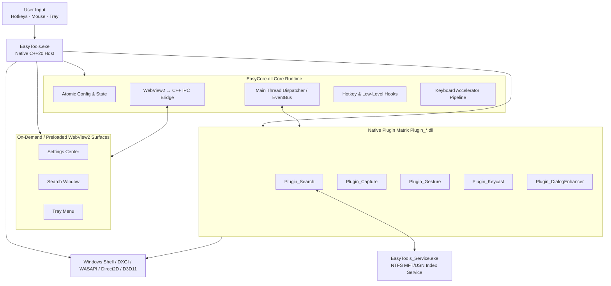

<div align="center">


# EasyTools

High-Performance Open-Source Productivity Suite for Windows 10/11

[简体中文](README.md) · [English](README.en.md)

[](https://github.com/yuan278501381/easyTools/releases/latest)
[](LICENSE)
[](#system-requirements)
[](CMakeLists.txt)
[](ui/package.json)
[](ui/package.json)

</div>

EasyTools is a **high-performance, native modular productivity toolkit** engineered for Windows. Built upon a native C++20 microkernel with Direct2D/D3D11 GPU rendering, paired with a React, TypeScript, and WebView2 glass UI, EasyTools seamlessly integrates **instant local file search, mouse gestures, screen capture & recording, file dialog enhancements, keystroke visualization, pointer highlight effects, and remote desktop boost** into one unified, rock-solid desktop application.

---

## 🌟 The 7 Core Modules Matrix

| Module | Key Capabilities | Scenarios & Technical Highlights |
| :--- | :--- | :--- |
| **🔍 Instant File Search** | Full-disk NTFS MFT/USN indexing; pinyin, wildcard & Everything-style syntax; multi-format Office/code/PDF/PSD content search | `Alt+Space` 0ms instant launch; 64-byte compact in-memory index & StringArena pooling for million-file real-time results |
| **🖱️ Mouse Gestures** | 8-direction precision recognition, fillet-folding smoothing & debounce; per-app scope rules; screen Hot Corners | Fluid right-click strokes, local compact layered viewport rendering, instant window management, hotkeys, and Lua scripts |
| **📸 Screen Capture & Recording** | Direct3D11/DXGI GPU zero-copy capture, auto-snapping; rich text/increment badge/inpaint annotations; always-on-top pins; 60FPS HW recording | Scrolling capture with feature stitching; WASAPI speaker + mic loopback mixing; click ripple effects |
| **📂 File Dialog Enhancer** | Smart path memory per host application; top floating glass ribbon for one-click jump to the active File Explorer folder | Eliminates the friction of repeatedly navigating deep directory paths when saving or opening files |
| **⌨️ Keystroke Display (Keycast)** | Glass keycap badge overlay, in-row combo repeat counters (`Ctrl+C ×3`), physics damping motion; local heatmap & activity trends | Essential for tutorials, demos, presentations, and power coders; 100% offline privacy preservation |
| **💡 Pointer Spotlight & FX** | Double-tap `Ctrl` to focus with a spotlight vignette; fluid click ripple diffusion; motion trail particles | Perfect for presentations, teaching, and live demos; 1-pixel geometric avoidance prevents Focus Assist triggers |
| **🖥️ Remote Desktop Boost** | Immersive host hotkey tunneling, 11-channel modifier key emergency flush, and smart remote IME sanitizing | Unilateral host-side enhancement without remote software installation; double-tap Right-Ctrl instantly resolves stuck remote Alt/Win/Shift keys |

---

## 🎬 Visual Feature Showcase

### 1. 🔍 Instant Local File & Content Search

> Instant launch via `Alt+Space`. Powered by NTFS MFT low-level parsing and USN Journal incremental monitoring, supporting wildcard, regex, and full-text extraction from Office/code files.

<p align="center">
  
</p>

* **Sub-Millisecond Search**：Indexes millions of files in hundreds of milliseconds with a 64-byte contiguous in-memory structure and StringArena interning.
* **Everything-Style Advanced Syntax**：Full support for `ext:docx|xlsx`, `file:`, `folder:`, `size:>100mb`, `parent:`, `!` exclusion, and more.
* **Multi-Format Content Search**：Extracts content on the fly from plain text, source code, Word, Excel, PowerPoint, WPS, XMind, PSD metadata, and AutoCAD DXF drawings.

---

### 2. 💡 Pointer Spotlight & Physics Micro-Effects

> Double-tap `Ctrl` to trigger a spotlight vignette focusing on your mouse pointer; click to emit subtle water ripples; slide to leave a smooth particle stream.

<p align="center">
  
</p>

* **Double-Tap `Ctrl` Spotlight**：Dimmest the non-active screen area smoothly, tracking the cursor seamlessly during speeches and demos.
* **Click Ripple Animation**：Left/right clicks emit physics-based concentric ripple waves with distinct accent colors.
* **Luminous Motion Trail**：Gliding the mouse leaves crisp subpixel particle trails rendered via ClearType subpixel positioning.
* **Focus Assist Avoidance**：Shrinks the physical overlay by 1 pixel (`vw-1, vh-1`), breaking Windows full-screen exclusive detection and preventing accidental Do-Not-Disturb (🔔z) triggers.

---

### 3. 🖱️ Mouse Gestures & Screen Hot Corners

> Hold right-click and trace natural gestures. Features 8-direction recognition with fillet-folding corner smoothing for effortless window and desktop control.

<p align="center">
  
</p>

* **Fillet-Folding Corner Smoothing**：Proprietary inflection-point smoothing with ±22.5° angular tolerance for high-accuracy gesture decoding.
* **Fine-Grained Scope Rules**：Define global gestures or bind distinct actions for specific applications (browsers, IDEs) and targets (Desktop, Taskbar).
* **Screen Hot Corners**：Fling the cursor into any screen corner to instantly trigger actions like showing the desktop, taking a screenshot, or locking the screen.
* **Compact Dynamic Viewport**：Restricts gesture overlays to 100~300px local bounding boxes, eliminating full-screen DWM composition overhead.

---

### 4. 📸 Capture, Smart Markup, Pinning & HD Recording

> GPU zero-copy capture with automatic window magnetic snapping, AI-free smart inpainting, and always-on-top image pinning.

<table>
  <tr>
    <td width="50%" align="center">
      <br />
      <sub>Multi-format content extraction and layout controls</sub>
    </td>
    <td width="50%" align="center">
      <br />
      <sub>Unified shortcut management and conflict detection</sub>
    </td>
  </tr>
</table>

* **Professional Annotation Toolkit**：Rectangles, arrows (standard/thin/bidirectional), ellipses, highlighters, mosaics, magnifiers, **incremental step badges (①②③)**, and background-reconstruction **Inpaint**.
* **Always-on-Top Pinning (Pin Window)**：Pin captures to the desktop with smooth mouse wheel zooming, 90° rotation, flipping, re-editing, and screen-edge magnetic snapping.
* **Scrolling Capture**：Smooth automatic scrolling combined with OpenCV feature matching for seamless long-page stitching.
* **60FPS High-Definition Recording**：Native FFmpeg hardware acceleration (NVENC/QSV/AMF/CPU), WASAPI loopback audio mixing, and click ripple effects.

---

### 5. 📂 File Dialog Enhancer

> Eliminates the friction of Windows file navigation. Automatically tracks historical folders per application and attaches a floating glass ribbon to jump to the active File Explorer folder in one click.

---

### 6. ⌨️ Keystroke Display & Local Input Analytics

> Low-level global keyboard hook captures modifier combinations, displaying glass keycap badges with damping slide-in and bubble-pop micro-animations.

<table>
  <tr>
    <td width="50%" align="center">
      <br />
      <sub>Local keyboard heatmap and activity trends</sub>
    </td>
    <td width="50%" align="center">
      <br />
      <sub>General options: accent colors, auto-start, and permissions</sub>
    </td>
  </tr>
</table>

---

### 7. Tray Quick Menu

<p align="center">
  
</p>
<p align="center"><sub>System tray quick menu: toggle all 7 core modules and access frequent actions instantly.</sub></p>

---

## 📥 Download & Installation

1. Download the latest installer (`EasyTools-Setup-*.exe`) or portable package from [GitHub Releases](https://github.com/yuan278501381/easyTools/releases/latest).
2. The setup installer configures auto-start and the elevated indexing service. The portable package runs immediately out of the box with zero registry pollution.
3. Default global search shortcut is `Alt+Space`. All shortcuts can be customized with real-time conflict detection in Settings.

---

## 💻 System Requirements

- **Operating System**：Windows 10 / Windows 11 (x64)
- **Runtime Environment**：Microsoft Edge WebView2 Runtime (pre-installed on most modern Windows systems)
- **Hardware Acceleration**：DirectX 11 / Direct2D compatible GPU; NVENC / QSV / AMF hardware encoding for screen recording

---

## 🔒 Privacy & Local-First Philosophy

* **100% Local Processing**：File search indices, OCR extraction, keystroke statistics, captures, and recordings remain entirely on your local machine. **No user accounts, no telemetry uploads, and no privacy leakage.**
* **Security Sandboxing**：Integrated Lua scripting engine enforces strict permission boundaries; Named Pipe IPC validates cryptographically secure tokens and client Windows SIDs.

---

## 🛠️ Build from Source

### Prerequisites
- Visual Studio 2022 (with **Desktop development with C++** workload)
- CMake 3.25+
- PowerShell 7+
- Node.js 24+
- vcpkg (recommended at `C:\vcpkg`)
- Inno Setup 6 (required only for packaging installers)

### One-Click Idempotent Build
Run the automated PowerShell deployment script from the repository root:

```powershell
pwsh -NoProfile -File .\deploy.ps1 -Configuration Release
```

Build outputs will be generated in `build/bin/Release` and `deploy_dist`.

---

## 🏗️ Architecture & Microkernel Model



* **Cold-Path Working-Set Trimming**：Actively invokes `WinUtils::trimWorkingSet()` upon lifecycle milestones (capture completed, recording stopped, overlay destroyed, window hidden), maintaining zero impact on hot input paths.
* **Keyboard Accelerator Pipeline**：Intercepts native Win32 system menu accelerators and Chromium browser shortcuts, guaranteeing 100% reliable forwarding for shortcuts like `Alt+Space`.

---

## 🤝 Contributing

Contributions, issues, and feature requests are warmly welcome!
- When filing an issue, please specify the EasyTools version, Windows OS build, and reproduction steps.
- For architectural extensions, check out: [Plugin Development Guide](docs/plugin-development.md) · [Lua API Reference](docs/api/lua-api.md) · [Versioning Guide](docs/versioning.md).

---

## 📄 License & Attribution

This project is licensed under the **[MIT License](LICENSE)**.

* **Author**：**`Yy1 (yuan278501381)`** (GitHub: [@yuan278501381](https://github.com/yuan278501381))
* **Repository**：[https://github.com/yuan278501381/easyTools](https://github.com/yuan278501381/easyTools)
* **Copyright**：`Copyright (c) 2026 Yy1 (yuan278501381) & EasyTools contributors`
