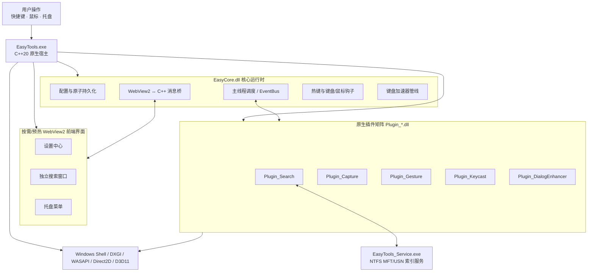

<div align="center">


# EasyTools

面向 Windows 10/11 的高性能开源桌面效率工具集

[简体中文](README.md) · [English](README.en.md)

[](https://github.com/yuan278501381/easyTools/releases/latest)
[](LICENSE)
[](#系统要求)
[](CMakeLists.txt)
[](ui/package.json)
[](ui/package.json)

</div>

EasyTools 是一款专为 Windows 平台打造的**高性能原生桌面效率工具集**。项目采用 C++20 原生微内核与 Direct2D/D3D11 高性能渲染，配合 React、TypeScript 与 WebView2 构建世界级微晶设计界面，将**本地文件极速搜索、鼠标手势、截图录屏、文件对话框助手、按键显示、鼠标演示特效与远程协助增强** 7 大核心效率模块融为一体，带来极致流畅、坚如磐石的桌面效率体验。

---

## 🌟 7 大核心功能矩阵

| 模块 | 核心能力 | 适用场景与技术亮点 |
| :--- | :--- | :--- |
| **🔍 本地文件搜索** | NTFS MFT/USN 全盘秒级索引；拼音混搜、Everything 级高级语法；Office/代码/PDF/PSD 多格式正文内容搜索 | `Alt+Space` 0ms 秒开，全内存连续索引与 StringArena 池化，百万级文件毫秒即输即得 |
| **🖱️ 鼠标手势** | 8 方向高精度手势识别、拐点消除与平滑消抖；独立程序作用域规则；屏幕四角触发角 (Hot Corners) | 右键划线行云流水，局部微型视口渲染，极速执行窗口管理、快捷键与 Lua 自定义脚本 |
| **📸 截图与录屏** | GPU 零拷贝捕获、智能吸附；富文本/递增序号/智能消除/放大镜标注；置顶磁吸贴图；60FPS 硬件加速录屏 | 滚动长截图智能特征拼接，WASAPI 系统扬声器+麦克风多轨混音，光标点击水波纹特效 |
| **📂 文件对话框助手** | 按发起程序智能记忆最近目录；顶部微晶 Ribbon 胶囊条一键直达当前活跃的资源管理器路径 | 彻底终结在 Windows 保存/打开文件时反复找寻深层路径的繁琐痛点 |
| **⌨️ 按键显示** | 组合快捷键微晶胶囊回显、同排连击计数 (`Ctrl+C ×3`)、阻尼物理动效；本地输入热力图与活动趋势 | 教程录制、演示直播与极客码字神器；数据 100% 本地留存，绝不上报隐私 |
| **💡 鼠标演示** | 双击 `Ctrl` 聚光灯聚焦暗角；点击水波纹扩散动效；鼠标移动流光粒子轨迹 | 演讲、授课、开会与演示高光利器；1 像素全屏几何避让，杜绝触发系统专注助手 |
| **🖥️ 远程协助增强** | 主控端沉浸式系统热键穿透、11 通道修饰键卡死急救冲刷、远控输入法智能脱敏 | 主控单边原生增强，被控端无需安装任何软件；双击右 Ctrl 秒解远程 Alt/Win/Shift 卡死痛点 |

---

## 🎬 核心功能视觉展示 (Visual Showcase)

### 1. 🔍 本地文件极速搜索与内容检索 (Instant Search)

> `Alt+Space` 瞬间呼出。基于 NTFS MFT 底层解析与 USN 增量监听，支持拼音全拼/简拼混搜、通配符、正则与 Office/代码正文内容提取。

<p align="center">
  
</p>

* **毫秒全盘秒搜**：单盘数百万文件初次索引仅需数百毫秒，全内存 64 字节紧凑排布与 StringArena 字符串池化。
* **Everything 级高级语法**：支持 `ext:docx|xlsx`、`file:`、`folder:`、`size:>100mb`、`parent:`、`!` 排除等丰富表达式。
* **多格式文档内容检索**：纯文本、常用代码、Word、Excel、PPT、WPS、XMind、PSD 元数据与 DXF 图纸文本图元实时提取。

---

### 2. 💡 鼠标演示与物理微动效 (Spotlight & Pointer FX)

> 双击 `Ctrl` 触发优雅的聚光灯暗角聚焦，点击散发细腻的水波纹扩散动效，移动伴随流畅的流光粒子轨迹。

<p align="center">
  
</p>

* **双击 `Ctrl` 聚光灯**：智能暗化非焦点区域，光圈平滑跟随光标移动，演讲与演示时瞬间抓住观众视线。
* **点击扩散水波纹**：左键/右键点击呈现不同强调色的水波纹物理扩散动画。
* **流光移动轨迹**：鼠标滑动时拉出平滑流光粒子线条，高分屏 ClearType 次像素饱满渲染。
* **专注助手避让机制**：物理尺寸微缩 1 像素，底层打破 Windows 全屏独占判定，杜绝误触发 🔔z 免打扰。

---

### 3. 🖱️ 鼠标手势与屏幕触发角 (Mouse Gestures & Hot Corners)

> 按住鼠标右键划出自然轨迹，8 方向高精度手势识别与转弯圆角平滑消抖，行云流水触发各种窗口与桌面动作。

<p align="center">
  
</p>

* **转弯圆角消抖 (Fillet Folding)**：独创拐点消抖算法，容差角 ±22.5°，随手一划精准识别。
* **多维度作用域规则 (Scope Rules)**：支持全局手势、特定应用（如浏览器、IDE）与特殊目标（桌面、任务栏）独立绑定。
* **屏幕四角触发角 (Hot Corners)**：鼠标甩到屏幕角落即刻触发预设动作（如显示桌面、截图或锁屏）。
* **局部微型视口渲染**：轨迹绘制仅使用 100~300px 局部动态包围盒，DWM 合成零延迟。

---

### 4. 📸 截图、智能标注、置顶贴图与高清录屏 (Screen Capture & Recording)

> 支持 Direct3D11/DXGI GPU 零拷贝高速捕获与窗口自动吸附，配备智能消除与置顶磁吸贴图。

<table>
  <tr>
    <td width="50%" align="center">
      <br />
      <sub>多格式内容检索与显示偏好</sub>
    </td>
    <td width="50%" align="center">
      <br />
      <sub>全局快捷键集中管理与冲突检测</sub>
    </td>
  </tr>
</table>

* **专业标注工具箱**：支持矩形、箭头（标准/细线/双向）、椭圆、荧光高亮、马赛克、放大镜、**递增序号微徽章 (①②③)** 与基于背景重建的**智能消除 (Inpaint)**。
* **置顶磁吸贴图 (Pin Window)**：截图一键固定在屏幕顶层，支持滚轮缩放、旋转、翻转、重新标注编辑与靠近屏幕边缘自动磁吸。
* **滚动长截图 (Scroll Capture)**：自动平滑滚动并利用 OpenCV 特征匹配实时缝合超长页面。
* **高清 60FPS 屏幕录制**：基于 FFmpeg 原生硬件加速（NVENC/QSV/AMF/CPU），WASAPI 扬声器回环+麦克风多轨混音录制。

---

### 5. 📂 文件对话框助手 (Dialog Enhancer)

> 深度解决 Windows 文件打开与保存痛点。自动记忆各应用程序历史目录，并在标准文件对话框顶部挂载微晶 Ribbon 胶囊条，一键切换至当前资源管理器路径。

---

### 6. ⌨️ 按键回显与本地数据统计 (Keycast & Statistics)

> 全局键盘钩子捕获组合键输入，带有阻尼滑入与气泡冒出微动效；本地记录按键热力图，隐私 100% 留在本机。

<table>
  <tr>
    <td width="50%" align="center">
      <br />
      <sub>本地键盘热力图与近期活动趋势</sub>
    </td>
    <td width="50%" align="center">
      <br />
      <sub>通用设置：主题色、开机自启与运行权限</sub>
    </td>
  </tr>
</table>

---

### 7. 托盘快速菜单与轻量管理 (Tray Quick Menu)

<p align="center">
  
</p>
<p align="center"><sub>系统托盘快捷菜单：一键启停 7 大核心模块、快速呼出常用功能与运行状态。</sub></p>

---

## 📥 下载与使用

1. 从 [GitHub Releases](https://github.com/yuan278501381/easyTools/releases/latest) 下载最新安装包（`EasyTools-Setup-*.exe`）或绿色便携包。
2. 安装版支持开机自启与后台高权限文件索引服务；便携版解压即用，配置自动存储于所在目录。
3. 默认全局搜索快捷键为 `Alt+Space`，所有快捷键均可在设置中心进行个性化配置与冲突检测。

---

## 💻 系统要求

- **操作系统**：Windows 10 / Windows 11 (x64)
- **运行环境**：Microsoft Edge WebView2 Runtime（多数 Windows 10/11 已内置）
- **硬件支持**：支持 DirectX 11 / Direct2D 硬件加速显卡；支持 NVENC / QSV / AMF 录屏硬件加速

---

## 🔒 隐私与安全性保障

* **100% 本地运算**：文件搜索索引、OCR 识别、按键统计、截图与录屏数据全部在本地内存与磁盘完成，**不设立用户账户，不上传任何文件内容与隐私数据**。
* **本机可信与权限隔离**：内置 Lua 脚本引擎定位为本机可信自动化环境，敏感扩展能力按声明权限受控；命名管道 IPC 采用强随机令牌与 Windows 用户 SID 双重隔离校验。

---

## 🛠️ 从源码构建 (Build from Source)

### 环境准备
- Visual Studio 2022 (安装“使用 C++ 的桌面开发”工作负载)
- CMake 3.25+
- PowerShell 7+
- Node.js 24+
- vcpkg（默认推荐路径为 `C:\vcpkg`）
- Inno Setup 6（仅制作安装包时需要）

### 一键幂等部署命令
在仓库根目录下运行 PowerShell 自动化脚本：

```powershell
pwsh -NoProfile -File .\deploy.ps1 -Configuration Release
```

构建产物将自动生成至 `build/bin/Release` 与 `deploy_dist` 目录。

---

## 🏗️ 架构设计与微内核模型



* **冷路径内存退场修剪**：在截图完成、录屏结束、贴图销毁及窗口隐藏等生命周期终点主动调用 `WinUtils::trimWorkingSet()` 归还物理内存，热路径零开销。
* **全链路键盘加速器管线**：挂载 `KeyboardPipeline` 拦截 Win32 系统菜单键并屏蔽 Chromium 默认浏览器快捷键，保证 `Alt+Space` 等按键 100% 稳定投递。

---

## 🤝 参与贡献

欢迎提交 Issue 和 Pull Request！
- 提交 Issue 时，请注明 EasyTools 版本、Windows 系统版本及复现步骤。
- 更多扩展机制请参阅：[插件开发指南](docs/plugin-development.md) · [Lua API 手册](docs/api/lua-api.md) · [版本管理规范](docs/versioning.md)。

---

## 📄 开源许可证与作者署名

本项目基于 **[MIT License](LICENSE)** 协议开源。

* **项目作者**：**`Yy1 (yuan278501381)`**（GitHub：[@yuan278501381](https://github.com/yuan278501381)）
* **项目仓库**：[https://github.com/yuan278501381/easyTools](https://github.com/yuan278501381/easyTools)
* **法定版权**：`Copyright (c) 2026 Yy1 (yuan278501381) & EasyTools contributors`
